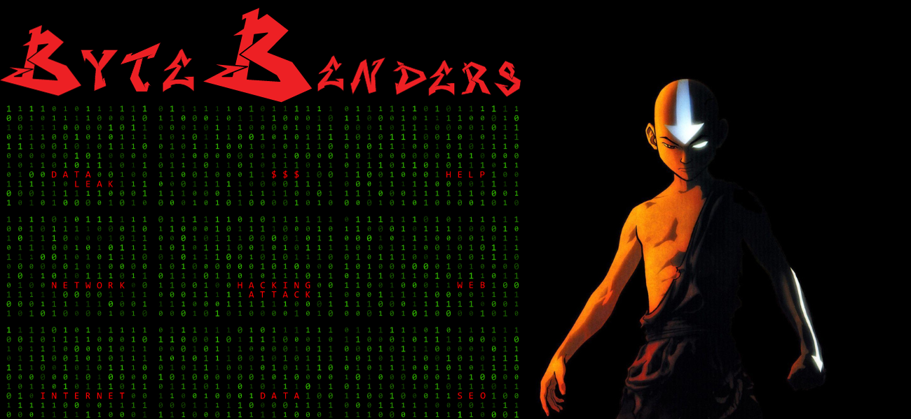

# **Byte Benders**

      

    <a href="#objetivo"> Objetivo do Projeto </a> | 
    <a href="#visao"> Visão do Sistema </a> |
    <a href="#metodologia"> Metodologia </a> |  
    <a href="#mvp"> MVP </a> | 
    <a href="#sprint-backlog"> Sprint Backlog </a> | 
    <a href="#product-backlog"> Product Backlog </a> | 
    <a href="#prototipo"> Como utilizar o Protótipo </a> | 
     | 

# Byte Benders
Repositório destinado ao grupo Byte Benders, para desenvolvimento da API do primeiro semestre de ADS.

# 🎯Objetivo do Projeto
Desenvolver um site que sirva como um curso, indicando e ensinando todos os processos e artefatos da metodologia SCRUM. Status do projeto: Em andamento 🏇

# 💡Visão do Sistema
Para uma equipe que deseja aprender e aperfeiçoar seus conhecimentos em relação às metodologias ágeis utilizando o Scrum.

#  👨🏿‍💻 Metodologia 
A metodologia utilizada para a criação do protótipo responsivo foi o **Figma**, para o product backlog e o process backlog foi utilizado os conhecimentos e ferramentas do **Product Owner** que serão documentadas abaixo. Para o produto final, serão utilizadas as linguagens de programação **Python, HTML e CSS**. E para organização da equipe e do processo, foi utilizado como metodologias ágeis o **Scrum**.

# 🏆MVP

1. WireFrame: **(**[Protótipo Navegável](https://encurtador.com.br/mnopM)**): Concluído**✅

# Sprint Backlog 
| Item | Definição | Sprint | ID | Prioridade | Estimativa de Esforço | Data de Entrega | Status |
| ---- | --------- | ------ | ---| ---------- | --------------------- | ------ | --------------- |
|PRODUCT BACKLOG|“Eu como gerente quero alinhar minha equipe na aplicação do Scrum".| **1** | #1 | 100 | 05h | **Concluído**✅  | 9/24/2023 | 
|WIREFRAME| “Eu como Scrum Master quero facilitar e orientar a equipe no método Scrum".| **1** | #1 | 95 | 04h | **Concluído**✅| 9/24/2023 |
|WIREFRAME| “Eu como Scrum Master quero garantir reuniões rápidas e objetivas”.| **1** | #1 | 90 | 04h | **Concluído**✅ | 9/24/2023 |
|WIREFRAME|“Eu como Product Owner quero passar a visão do produto para a equipe de desenvolvimento”.| **1** | #1 | 85 | 04h | **Concluído**✅ | 9/24/2023 |
|WIREFRAME| “Eu como Product Owner quero praticar a priorização de tarefas”.| **1** | #1 | 80 | 04h | **Concluído**✅ | 9/24/2023 |
|WIREFRAME|“Eu como Procuct Owner quero saber cobrar resultados de forma efetiva/assertiva”.| **1** |#1 | 75 | 04h | **Concluído**✅ | 9/24/2023|
|WIREFRAME|“Eu como Scrum Team quero avaliar de forma eficiente quais as tecnologias necessárias para a execução de um projeto”. | **1** | #1 | 70 | 04h | **Concluído**✅ | 9/24/2023 |
|WIREFRAME|“Eu como Scrum Team quero avaliar de forma eficiente a quantidade de colaboradores necessários para a execução de um projeto dado um prazo estimado de realização”.  | **1** | #1 | 65 | 04h | **Concluído**✅ | 9/24/2023 |
|WIREFRAME|“Eu como Scrum Team quero promover a auto-organização e soft skills, para integrar comunicação, proatividade, colaboração com objetivo de potencializar a entrega nas Sprints”.  | **1** | #1 | 60 | 04h | **Concluído**✅ | 9/24/2023 |
|PRODUCT BACKLOG|Calendário de entregas de acordo com os desejos e requisitos do cliente. | **1** | #2 | 100 | 05h |**Concluído**✅ | 9/24/2023 |
|SITE INICIAL|“Eu como desenvolvedor quero alinhar minha equipe na aplicação do Scrum". | **2** | #3 | 100 | 04h | **Em andamento** | 15/10/2023 |
|SITE INICIAL|“Eu como Scrum Master quero facilitar e orientar a equipe no método Scrum". | **2**  | #3 | 95 | 04h | **Em andamento** | 15/10/2023 |
|SITE INICIAL|“Eu como Scrum Master quero garantir reuniões rápidas e objetivas”. | **2**  | #3 | 90 | 04h | **Em andamento** |15/10/2023 |
|SITE INICIAL|“Eu como Product Owner quero passar a visão do produto para a equipe de desenvolvimento”.| **2**  | #3 | 85 | 04h |  **Em andamento** | 15/10/2023 |
|SITE INICIAL|“Eu como Product Owner quero praticar a priorização de tarefas”. | **2**  | #3 | 80 | 04h |  **Em andamento** | 15/10/2023 |
|SITE INICIAL|“Eu como Procuct Owner quero saber cobrar resultados de forma efetiva/assertiva”.| **2**  | #3 | 75 | 04h |  **Em andamento** | 15/10/2023 |
|SITE INICIAL|“Eu como Scrum Team quero avaliar de forma eficiente quais as tecnologias necessárias para a execução de um projeto”.  | **2**  | #3 | 75 | 04h |  **Em andamento** | 15/10/2023 |
|SITE INICIAL|“Eu como Scrum Team quero avaliar de forma eficiente a quantidade de colaboradores necessários para a execução de um projeto dado um prazo estimado de realização”.  | **2**  | #3 | 65 | 04h | **Em andamento** | 15/10/2023 |
|SITE INICIAL|“Eu como Scrum Team quero promover a auto-organização e soft skills, para integrar comunicação, proatividade, colaboração com objetivo de potencializar a entrega nas Sprints”.  | **2** | #3 | 60 | 04h |  **Em andamento** | 15/10/2023 |

# Product Backlog
| Item | Prioridade | ID | Descrição | Sprint|
| ---- | ---------- | -- | --------- | ----- |
| Wireframe | 100 |#1| Protótipo WEB contendo uma prévia de todas as páginas do sistema. | **1** |
| Backlog | 100 |#2| Calendário de entregas de acordo com os desejos e requisitos do cliente. | **1** |
| Criação do Site Inicial - html | 95 |#3|Site inicial em HTML leal à proposta do wireframe, de forma suscinta. | **2**|
|Criação do Site Inicial - css | 90 |#4| Estilização da página com CSS e padronização das páginas, leal à proposta do wireframe, de forma suscinta. | **2**|
| Criação do Site Inicial - Flask | 100 |#5| --------- | **3** |
|Criação do formulário | 90 |#6|Formulário para avaliações parciais e finais. | **3** |
|Polimento | 80 |#7| Refinamento de código e adição de recursos responsivos. | **3** |
|Teste | 100 |#8| Teste do produto com intuito de encontrar e corrigir erros e bugs. | **4** |
|README |80|9| Documentação do projeto. | **4** |

# Como utilizar o Protótipo ❔

https://github.com/Marianatebecherani/api-2sem-2023/assets/103541614/f31bc1ae-d0f1-4f75-b967-f1476b8d8e42

# Colaboradores:
 |  
 

|  

 

  

   

  

  

  

  

